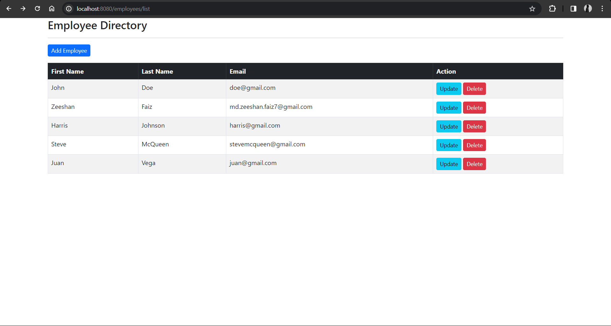

# Spring Boot Employee Directory Web Application Documentation



## Overview

Welcome to the Spring Boot Employee Directory Web Application, a project designed to manage and display employee details. This application leverages Spring Boot, Thymeleaf, JDBC, HTML, and CSS to create an interactive employee directory.

## Setup

1. **Initialize the Project:**
   - Visit [Spring Initializer](https://start.spring.io/).
   - Add dependencies: `Spring Web`, `Thymeleaf`, and `Spring Data JDBC`.
   - Generate and download the Maven project.

2. **Import Project:**
   - Import the downloaded project into your favorite IDE.

3. **Run Application:**
   - Run the main class, named as `EmployeeDirectoryApplication.java`.
   - The application will be available at [http://localhost:8080/employee/list](http://localhost:8080/employee/list).

## Application Functionalities

### Endpoint: http://localhost:8080/employee/list

This is the main landing page of the employee directory.

- **How to Access:**
  - Open your browser and navigate to [http://localhost:8080/employee/list](http://localhost:8080/employee/list).

### Functionality 1: View Employee List

This functionality allows users to view a list of all employees stored in the directory.

- **What it Does:**
  - Displays a table with employee details, including first name, last name, and email address.
  - Provides a clean and organized layout for easy navigation.

### Functionality 2: Add New Employee

Demonstrates how to add a new employee to the directory.

- **What it Does:**
  - Presents a form for entering new employee details.
  - Upon submission, the new employee is added to the directory and reflected in the employee list.

### Functionality 3: Update Employee Details

Illustrates how to update existing employee details.

- **What it Does:**
  - Allows users to select a specific employee from the list.
  - Presents a form pre-filled with the selected employee's details.
  - Upon submission, the employee's details are updated in the directory and reflected in the employee list.

### Functionality 4: Delete Employee

This functionality enables users to remove a specific employee from the directory.

- **What it Does:**
  - Provides a button or link next to each employee for deletion.
  - Upon confirmation, the selected employee is removed from the directory, and the employee list is updated.

## Sample Code

```java
// Sample code for Employee entity class
@Controller
@RequestMapping("/employees")
public class EmployeeController {

	@Autowired
	private EmployeeService employeeService;

	public EmployeeController(EmployeeService theEmployeeService) {
		employeeService = theEmployeeService;
	}

	@GetMapping("/list")
	public String listEmployees(Model theModel) {

		List<Employee> theEmployees = employeeService.findAll();

		theModel.addAttribute("employees", theEmployees);

		return "employees/list-employees";
	}

	@GetMapping("/showFormForAdd")
	public String showFormForAdd(Model theModel) {

		// create model attribute to bind form data
		Employee theEmployee = new Employee();

		theModel.addAttribute("employee", theEmployee);

		return "employees/employee-form";
	}

	@GetMapping("/showFormForUpdate")
	public String showFormForUpdate(@RequestParam("employeeId") int theId,
									Model theModel) {

		// get the employee from the service
		Employee theEmployee = employeeService.findById(theId);

		// set employee as a model attribute to pre-populate the form
		theModel.addAttribute("employee", theEmployee);

		// send over to our form
		return "employees/employee-form";
	}

	@PostMapping("/save")
	public String saveEmployee(@ModelAttribute("employee") Employee theEmployee) {

		// save the employee
		employeeService.save(theEmployee);

		// use a redirect to prevent duplicate submissions
		return "redirect:/employees/list";
	}

	@GetMapping("/delete")
	public String delete(@RequestParam("employeeId") int theId) {

		// delete the employee
		employeeService.deleteById(theId);

		// redirect to /employees/list
		return "redirect:/employees/list";
	}
}
